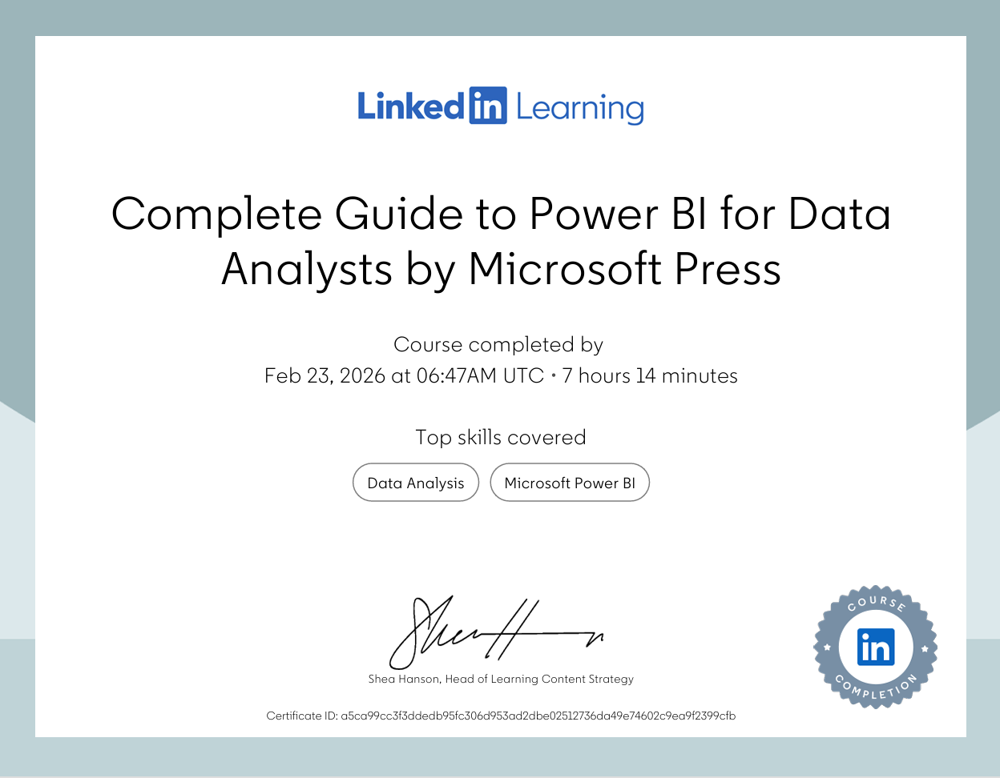

# Power_BI_Course_Sorensen_Microsoft_Press
This repository is a online log of my study of the Power BI course offered by Chris Sorensen/Microsoft Press on Linkedin Learning. 

## 🎓 Complete Guide to Power BI for Data Analysts

I successfully completed the **Complete Guide to Power BI for Data Analysts** course by **Chris Sorensen** in collaboration with **Microsoft**.

This course was completed during my personal leisure time outside of work, demonstrating my commitment to continuous professional development in Data Analytics and Business Intelligence.

---

## 📜 Certificate of Completion

---

## 📝 My Structured Course Notes

Throughout the course, I created detailed structured notes for each sub-lesson using Microsoft OneNote.  
These notes were exported into a consolidated PDF.

📄 [View My Power BI Course Notes (PDF)](docs/PowerBI_Notes.pdf)

---

## 🚀 Skills Gained

- Data Modeling
- Power Query (ETL)
- DAX (Calculated Columns & Measures)
- Data Visualization Best Practices
- Dashboard Development
- Business Intelligence Reporting
